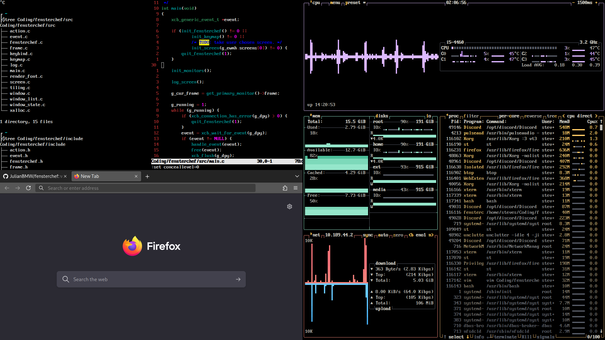
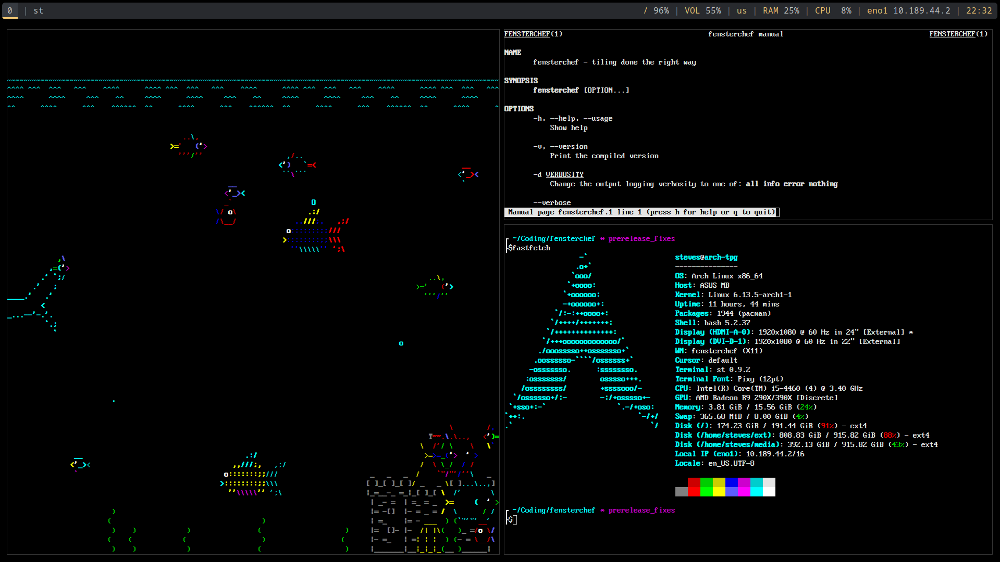

# Fensterchef – The X11 Tiling Window Manager

Fensterchef is a keyboard-centric tiling window manager for X11.

### Fensterchef includes

- Manual tiling
- Dynamic tiling
- Floating windows
- Dock windows of any kind
- Desktop windows
- Fullscreen windows
- Minimizing windows
- A simple configuration
- Sending of external commands

### Fensterchef does not include

- A builtin bar
- Window frames (only simple borders)
- Desktops or workspaces in i3 terms

### Why no workspaces?

Workspaces are a good way to group windows together but since windows can be
minimized and re-opened at any time through the window list or special hotkeys,
there is no need for that.

## Gallery

I am a boring person when it comes to customizing but this is how it might look:




## Installation

Get started immediately! Open a terminal and clone the repository:
```sh
git clone https://github.com/thepsauce/fensterchef.git
```
(Optional) If you want to check out the currently developing features:
```sh
git checkout developing
```
Then simply type the following and enter your password.
```sh
sudo make install
```

Now you have the **fensterchef** executable (`/usr/bin/fensterchef`) and the two
manual pages (`/usr/share/man/man1/fensterchef.1.gz` and
`/usr/share/man/man5/fensterchef.5.gz`).

If you are using a login manager, you can simply put this at the end of your
`~/.xsession`:
```
mkdir -p ~/.local/share/fensterchef
exec /usr/bin/fensterchef -dinfo 2>~/.local/share/fensterchef
```
Alternatively put it into the `~/.xinitrc`.

*How to get fensterchef to run exactly varies on your environment.*

### Try it out in the sandbox

If you have Xephyr installed you can (after cloning the repository) do:
```sh
make sandbox
```
This will open a 800x600 window in your current desktop environment in which you
can try out **fensterchef**.

## Bugs and feature requests

Report any issues directly to us over the Github issues tab.

An issue should start with the version, the rest is up to you. Try to add steps
to reproduce the issue and add the relevant excerpts from the log.

If it is a feature request, you can freely write anything.

## IRC

If you want to hang out with fensterchef users and developers you can join
`irc.libera.chat:6697` and find us in the channel named `#fensterchef`.
